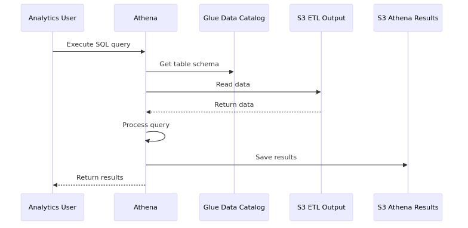

# Data Pipeline Sample

A sample data pipeline project using AWS Glue. This configuration extracts data from RDS, stores it in S3, and enables analysis with Athena.

## 📋 Project Overview

This project consists of the following components:

- **API**: Shop API service (Lambda + API Gateway + Aurora MySQL)
- **Batch**: ETL processing (Glue Jobs + Athena)
- **Infra**: AWS infrastructure configuration (Terraform)
- **Docs**: Design diagrams and documentation
- **Data Lake**: S3-based data lake (Parquet/CSV format)

## 🏗️ System Architecture

### Overall Architecture


### Data Flow


### Analytics Flow



### API Request Flow


## 📁 Project Structure

```
data-pipeline-sample/
├── api/                           # Shop API service
│   ├── src/                      # Lambda function source code
│   ├── Dockerfile                # Container image definition
│   └── Makefile                  # Build and deployment scripts
├── batch/                        # ETL processing scripts
│   ├── core_db_etl/             # Main ETL script (all tables)
│   ├── sales_analytics/         # Sales analytics data creation
│   └── Makefile                 # Script upload management
├── infra/                       # AWS infrastructure (Terraform)
│   ├── network/                 # VPC, subnets, security groups
│   ├── rds/                     # Aurora MySQL database
│   ├── s3/                      # S3 buckets for data lake
│   ├── glue/                    # Glue jobs, crawlers, connections
│   ├── athena/                  # Athena workgroup and queries
│   └── api/                     # API Gateway and Lambda
├── docs/                        # Documentation and diagrams
│   ├── architecture/            # System architecture diagrams
│   ├── flow/                    # Data flow diagrams
│   ├── sequence/                # Sequence diagrams
│   ├── diagrams/                # Additional diagrams
│   └── src/                     # Source files for diagrams
└── README.md                    # This file
```
