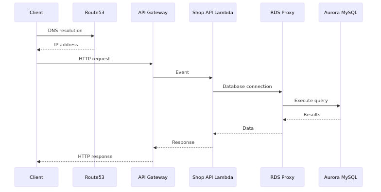

# Data Pipeline Sample

A sample data pipeline project using AWS Glue. This configuration extracts data from RDS, stores it in S3, and enables analysis with Athena.

## 📋 Project Overview

This project consists of the following components:

- **API**: Shop API service (Lambda + API Gateway + Aurora MySQL)
- **Batch**: ETL processing (Glue Jobs + Athena)
- **Infra**: AWS infrastructure configuration (Terraform)
- **Docs**: Design diagrams and documentation
- **Data Lake**: S3-based data lake (Parquet/CSV format)

## 🏗️ System Architecture

### Overall Architecture

### Data Flow

### API Request Flow

