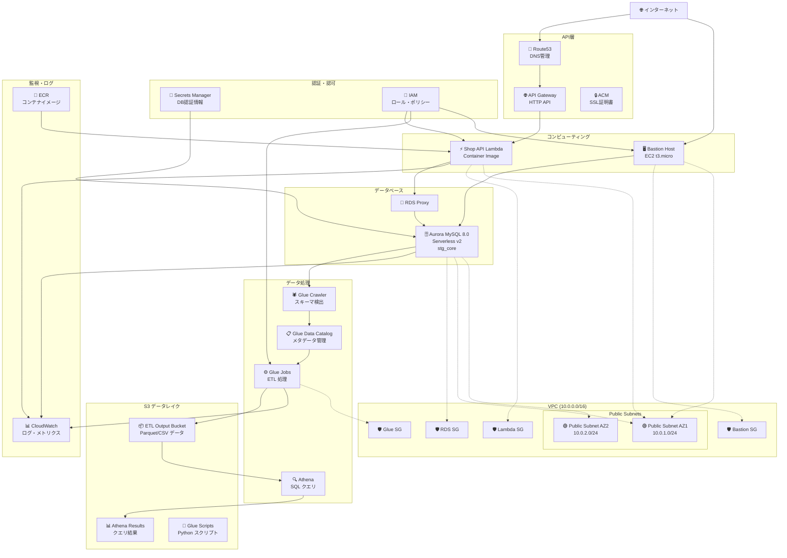
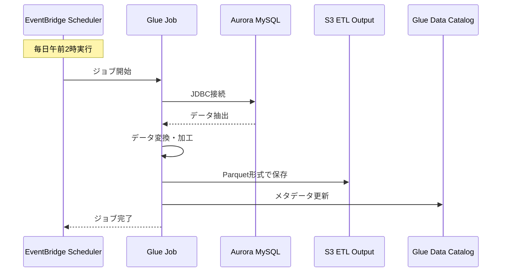
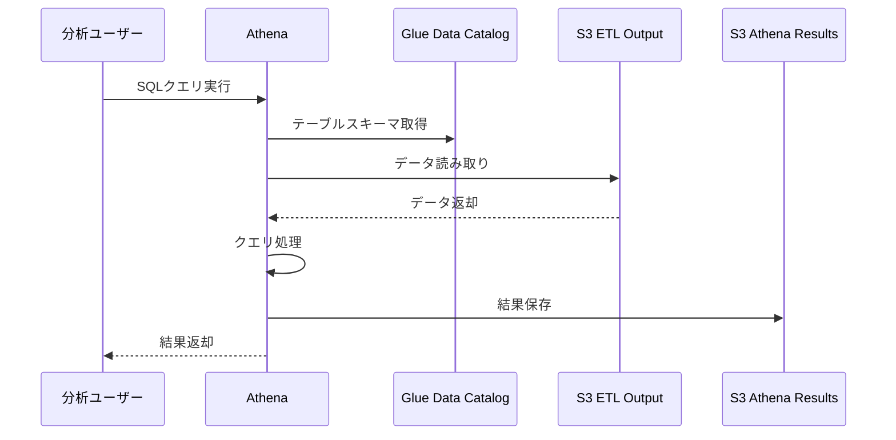
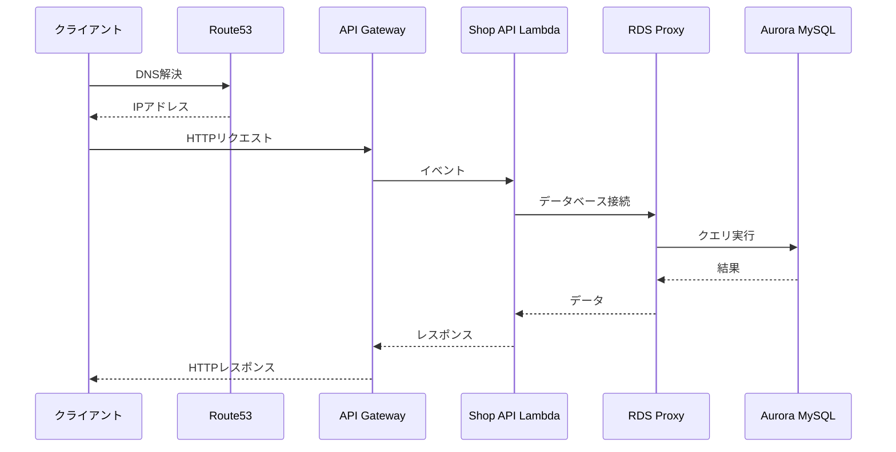

# データパイプライン インフラ構成図

## 全体アーキテクチャ

## データフロー詳細

### 1. データ抽出・変換フロー (ETL)

### 2. データ分析フロー

### 3. API リクエストフロー

## 主要コンポーネント詳細

### ネットワーク構成
- **VPC**: `10.0.0.0/16`
- **Public Subnets**: 
  - AZ1: `10.0.1.0/24`
  - AZ2: `10.0.2.0/24`
- **Private Subnets**: 現在コメントアウト（検証用）

### データベース構成
- **Aurora MySQL 8.0**: Serverless v2
- **スケーリング**: 0.5-2 ACU
- **バックアップ**: 1日保持
- **ログ**: audit, error, general, slowquery

### S3バケット構成
1. **ETL Output Bucket**: Glue Jobの出力先
2. **Athena Results Bucket**: クエリ結果保存
3. **Glue Scripts Bucket**: Pythonスクリプト保存

### Glue構成
- **Crawler**: 1時間毎にスキーマ検出
- **Data Catalog**: メタデータ管理
- **Jobs**: ETL処理（現在コメントアウト）

### セキュリティ
- **IAM**: 最小権限の原則
- **Secrets Manager**: データベース認証情報
- **Security Groups**: 必要最小限の通信許可
- **VPC Endpoints**: AWSサービスへのプライベート接続

## 環境情報
- **環境**: staging
- **リージョン**: ap-northeast-1
- **プロジェクト**: data-pipeline-sample
- **命名規則**: `{env}-{project}-{resource}`

## 今後の拡張予定
1. **Glue Jobs**: ETL処理の本格運用
2. **EventBridge Scheduler**: 定期実行の自動化
3. **Private Subnets**: 本番環境でのプライベートサブネット活用
4. **CloudWatch Alarms**: 監視・アラートの強化
5. **Backup Strategy**: データバックアップ戦略の確立
