# Data Pipeline Infrastructure Architecture Diagram

## Overall Architecture

```mermaid
graph TB
    %% External Internet
    Internet[🌐 Internet]
    
    %% Network Layer
    subgraph "VPC (10.0.0.0/16)"
        subgraph "Public Subnets"
            AZ1_PUB[🟢 Public Subnet AZ1<br/>10.0.1.0/24]
            AZ2_PUB[🟢 Public Subnet AZ2<br/>10.0.2.0/24]
        end
        
        %% Security Groups
        SG_Bastion[🛡️ Bastion SG]
        SG_RDS[🛡️ RDS SG]
        SG_Lambda[🛡️ Lambda SG]
        SG_Glue[🛡️ Glue SG]
    end
    
    %% Computing Layer
    subgraph "Computing"
        Bastion[🖥️ Bastion Host<br/>EC2 t3.micro]
        Lambda[⚡ Shop API Lambda<br/>Container Image]
    end
    
    %% Database Layer
    subgraph "Database"
        RDS[🗄️ Aurora MySQL 8.0<br/>Serverless v2<br/>stg_core]
        RDS_Proxy[🔄 RDS Proxy]
    end
    
    %% Data Lake Layer
    subgraph "S3 Data Lake"
        S3_ETL[📦 ETL Output Bucket<br/>Parquet/CSV Data]
        S3_Athena[📊 Athena Results<br/>Query Results]
        S3_Scripts[📝 Glue Scripts<br/>Python Scripts]
    end
    
    %% Data Processing Layer
    subgraph "Data Processing"
        Glue_Crawler[🕷️ Glue Crawler<br/>Schema Detection]
        Glue_Catalog[📋 Glue Data Catalog<br/>Metadata Management]
        Glue_Jobs[⚙️ Glue Jobs<br/>ETL Processing]
        Athena[🔍 Athena<br/>SQL Queries]
    end
    
    %% API Layer
    subgraph "API Layer"
        API_GW[🌐 API Gateway<br/>HTTP API]
        Route53[📍 Route53<br/>DNS Management]
        ACM[🔒 ACM<br/>SSL Certificates]
    end
    
    %% Authentication & Authorization Layer
    subgraph "Authentication & Authorization"
        Secrets[🔐 Secrets Manager<br/>DB Credentials]
        IAM[👤 IAM<br/>Roles & Policies]
    end
    
    %% Monitoring & Logging
    subgraph "Monitoring & Logging"
        CloudWatch[📊 CloudWatch<br/>Logs & Metrics]
        ECR[🐳 ECR<br/>Container Images]
    end
    
    %% Connection Relationships
    Internet --> Route53
    Route53 --> API_GW
    API_GW --> Lambda
    Lambda --> RDS_Proxy
    RDS_Proxy --> RDS
    
    Internet --> Bastion
    Bastion --> RDS
    
    %% Data Flow
    RDS --> Glue_Crawler
    Glue_Crawler --> Glue_Catalog
    Glue_Catalog --> Glue_Jobs
    Glue_Jobs --> S3_ETL
    S3_ETL --> Athena
    Athena --> S3_Athena
    
    %% Authentication & Authorization Flow
    Secrets --> RDS
    IAM --> Lambda
    IAM --> Glue_Jobs
    IAM --> Bastion
    
    %% Monitoring Flow
    Lambda --> CloudWatch
    Glue_Jobs --> CloudWatch
    RDS --> CloudWatch
    
    %% Container Management
    ECR --> Lambda
    
    %% Security Groups
    Bastion -.-> SG_Bastion
    Lambda -.-> SG_Lambda
    RDS -.-> SG_RDS
    Glue_Jobs -.-> SG_Glue
    
    %% Subnet Placement
    Bastion -.-> AZ1_PUB
    Lambda -.-> AZ1_PUB
    RDS -.-> AZ1_PUB
    RDS -.-> AZ2_PUB
```

## Data Flow Details

### 1. Data Extraction & Transformation Flow (ETL)

### 2. Data Analysis Flow

### 3. API Request Flow

## Key Component Details

### Network Configuration
- **VPC**: `10.0.0.0/16`
- **Public Subnets**: 
  - AZ1: `10.0.1.0/24`
  - AZ2: `10.0.2.0/24`
- **Private Subnets**: Currently commented out (for verification)

### Database Configuration
- **Aurora MySQL 8.0**: Serverless v2
- **Scaling**: 0.5-2 ACU
- **Backup**: 1 day retention
- **Logs**: audit, error, general, slowquery

### S3 Bucket Configuration
1. **ETL Output Bucket**: Glue Job output destination
2. **Athena Results Bucket**: Query result storage
3. **Glue Scripts Bucket**: Python script storage

### Glue Configuration
- **Crawler**: Schema detection every hour
- **Data Catalog**: Metadata management
- **Jobs**: ETL processing (currently commented out)

### Security
- **IAM**: Principle of least privilege
- **Secrets Manager**: Database credentials
- **Security Groups**: Minimal necessary communication permissions
- **VPC Endpoints**: Private connection to AWS services

## Environment Information
- **Environment**: staging
- **Region**: ap-northeast-1
- **Project**: data-pipeline-sample
- **Naming Convention**: `{env}-{project}-{resource}`

## Future Expansion Plans
1. **Glue Jobs**: Full-scale ETL processing operations
2. **EventBridge Scheduler**: Automated periodic execution
3. **Private Subnets**: Leverage private subnets in production environment
4. **CloudWatch Alarms**: Enhanced monitoring and alerting
5. **Backup Strategy**: Establish data backup strategy
